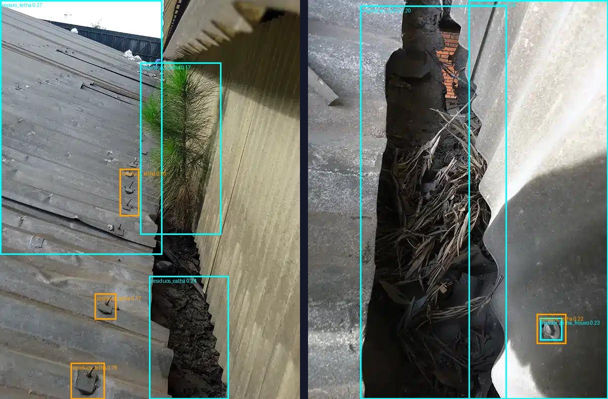

# Marcação automática de não conformidades — 05/10/2026

Origem: pedido do Cláudio para a IA tentar classificar e achar não conformidades sozinha, por exemplo detritos dentro da calha, e só depois ele aprovar, reprovar ou modificar.

## Como funciona

A IA marca cada foto com dois detectores e junta o resultado como **sugestões pendentes** na página de revisão:

1. **Piloto (YOLO26l treinado com o CEASA):** reconhece o que já viu nas fotos revisadas.
2. **Busca aberta (YOLOE-26l, vocabulário aberto):** procura objetos descritos em texto, sem precisar de fotos anotadas. As descrições ficam em [`configs/zero_shot_prompts.json`](../configs/zero_shot_prompts.json). Por exemplo, `residuos_calha` é procurada como "debris in roof gutter", "dirt and leaves inside gutter" e "clogged gutter", e vale a frase de maior confiança.

Quando os dois acham o mesmo objeto (mesma classe, IoU ≥ 0,5), a sugestão é uma só. Na página, cada sugestão da busca aberta mostra a frase que a encontrou, como em `Resíduos em calha · 24% · busca aberta: "dirt and leaves inside gutter"`. Os botões continuam os mesmos: Aceitar, Descartar e Substituir caixa. **Nada é aprovado sem você.**

A busca aberta também procura possíveis **não conformidades fora da taxonomia** (`uncatalogued`: ferrugem, água parada, furo, ninho, claraboia danificada). Elas não viram caixa de nenhuma classe; ficam registradas em `suggestions.json` → `uncatalogued` para você decidir se merecem uma classe nova (`migrate-review`).

Caixas da busca aberta que cobrem mais da metade da foto são descartadas (`max_area_fraction`), porque nesse caso o modelo está marcando o telhado inteiro.

## Como usar

Fotos novas, de qualquer edificação:

```powershell
.\.venv\Scripts\python.exe -m dronecamp_ia suggest --source "PASTA_DAS_FOTOS" --output data\reviews\galpao_b_v1 --group galpao_b_2026_10 `
  --weights runs\pilot_train_20261004T170212Z_dd284411\fit\weights\best.pt --zero-shot
```

Para uma revisão existente, troque `--source/--output/--group` por `--registry data\reviews\...\registry.json`. Depois, abra o `index.html` da pasta, revise e exporte o arquivo de decisões como antes. As caixas aceitas entram no próximo dataset pelo `import-review`.

**Antes da primeira vez no PC**, instale o extra (uma vez):

```powershell
uv pip install --python .venv\Scripts\python.exe -e ".[zero-shot]"
```

Na primeira execução, o YOLOE-26l (76 MB) e o MobileCLIP (242 MB) são baixados para `models/`, as frases são codificadas e o resultado fica em `models/zero_shot/`. Daí em diante, o codificador de texto não é mais usado. Se você editar as frases em `configs/zero_shot_prompts.json` (em inglês, a língua do modelo de texto), a próxima execução recodifica sozinha.

## Exemplo real: calhas de outras edificações

Revisão nova [`data/reviews/internet_v3_busca_aberta`](../data/reviews/internet_v3_busca_aberta/index.html), com as 7 fotos da internet e o piloto v7, gerou 37 sugestões pendentes:



Ciano é a busca aberta e laranja é o piloto.

- **Foto da esquerda (`vegetacao-dentro-calha`):** a busca aberta achou a planta como `vegetacao_calha` (17%) e a terra no fundo da calha como `residuos_calha` (24%). O piloto marcou só parafusos como `residuos_telha`. Também houve um erro: uma caixa grande de `reparo_telha` (27%) sobre a telha.
- **Foto da direita (`detritos-calha`):** a busca aberta delimitou a faixa da calha com detritos, mas chamou de `vegetacao_calha` (20%), porque os detritos são palha seca. A caixa de `residuos_calha` (29%) caiu na telha ao lado, no lugar errado. Marcou ainda um parafuso como `fixador_telha_frouxo` (23%). O piloto v8, que gerou a revisão anterior, não tinha sugerido nada nessa foto.

É por isso que tudo passa por você: a busca aberta acha regiões que o piloto não conhece, mas erra classe e posição com frequência.

## Medição nas fotos do CEASA

`evaluate-autolabel` compara, por classe, as sugestões com as caixas que você aprovou (mesma classe, IoU ≥ 0,5). Relatório: [`runs/autolabel_eval_20261005T151719Z_a99aebbb/report.json`](../runs/autolabel_eval_20261005T151719Z_a99aebbb/report.json).

| Nas 14 fotos fora do treino do piloto | Acertos / caixas humanas | Sugestões erradas |
| --- | ---: | ---: |
| Piloto | 7 / 29 | 19 |
| Busca aberta | 0 / 29 | 40 |
| Piloto + busca aberta | 7 / 29 | 59 |

Nas 37 fotos (a busca aberta nunca viu o CEASA), ela acerta 6 de 155 caixas. Os acertos se concentram em `vegetacao_calha` (3 de 4) e `residuos_calha` (2 de 12).

**Leitura honesta:** nas fotos do laudo (vista aérea e baixa resolução após extração do PDF), a busca aberta quase não acrescenta acertos e triplica as sugestões erradas. Nas fotos aproximadas de calha de outras edificações, ela encontra o que o piloto não vê. Por isso ela é **opcional** (`--zero-shot`), e não o padrão. Use-a em campanhas novas, principalmente de calhas, e deixe o piloto sozinho nas fotos parecidas com o CEASA.

Também foi testado o *visual prompting* do YOLOE, que usa as suas caixas aprovadas como exemplos em vez de frases. Ele teve 0 acertos nas 14 fotos e não foi incluído.

## O que melhora a marcação automática daqui para frente

Cada sugestão que você aceita ou corrige vira caixa aprovada e entra no próximo dataset. Fotos de calha de outras edificações revisadas com esta ferramenta são o caminho mais curto para o piloto aprender `residuos_calha` e `vegetacao_calha` fora do CEASA. A fila do `prioritize-review` ([aprendizado_rl_sklearn.md](aprendizado_rl_sklearn.md)) põe primeiro as fotos em que a IA mais erra.
